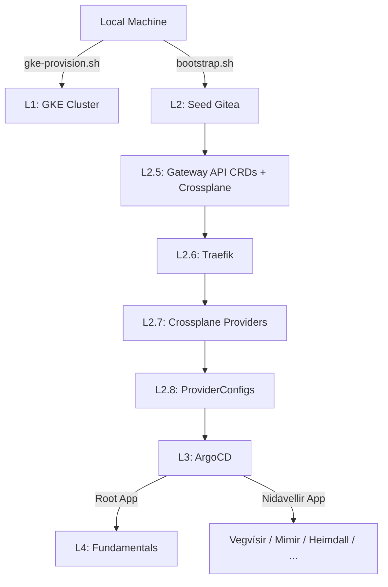
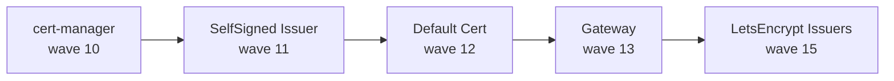

# Nordri Bootstrapping Strategy

This document details the bootstrapping process for Nordri clusters (GKE and Homelab).
It solves the "Chicken and Egg" problem of GitOps (ArgoCD needing a repo to install
itself) by injecting a **Seed Gitea** as the very first step.

**Nordri covers Layers 2–4.** Layers 5+ (platform services, user workloads) belong to
Nidavellir and Demicracy — separate repos deployed by ArgoCD once Nordri is stable.

## Bootstrap Layers

### Layer 1 — The Substrate (Kubernetes)
Provision the raw cluster before running any scripts.

- **GKE**: `./gke-provision.sh create`
- **Homelab**: k3s/Rancher Desktop, pre-existing

### Layer 2 — The Seed (Gitea + Nidavellir hydration)
`./bootstrap.sh [gke|homelab]`

- Installs **Gitea** (Helm, `gitea` namespace, ephemeral — no persistence)
- Creates Nordri and Nidavellir repos in Gitea via API
- Hydrates both repos from local checkouts (applies target overlay for Nordri)
- Nidavellir is expected as a sibling directory; override with `NIDAVELLIR_DIR`

### Layer 2.5 — Gateway API CRDs + Crossplane Core
- Installs **Gateway API CRDs** (required before Traefik's GatewayClass can register)
- Installs **Crossplane Core** (CRDs must exist before ArgoCD syncs ProviderConfigs)

### Layer 2.6 — Traefik (pre-ArgoCD)
- Installs **Traefik** via Helm into `kube-system`
- Registers `IngressRoute` CRDs needed by any ArgoCD-managed IngressRoute resources
- Sets `gateway.enabled=false` — the Gateway resource is owned by Vegvísir (Nidavellir)
- On GKE: provisions the LoadBalancer service (source of the cluster's external IP)

### Layer 2.7 — Crossplane Providers + Functions
- Applies `crossplane-providers.yaml` and waits for all providers to become Healthy
- Must be healthy before ProviderConfigs (Layer 2.8) can be applied

### Layer 2.8 — Crossplane ProviderConfigs + RBAC
- Applies `crossplane-configs.yaml` (ProviderConfig CRDs now exist from Layer 2.7)

### Layer 3 — ArgoCD
- Installs **ArgoCD** via Helm (`argocd` namespace)
- Applies the Root Application pointing at internal Gitea → ArgoCD takes over

### Layer 4 — Fundamentals (ArgoCD-managed)
ArgoCD syncs the Nordri app-of-apps. Components vary by target:

| Component | GKE | Homelab |
|---|---|---|
| Traefik (adopted by ArgoCD) | ✅ | ✅ |
| Crossplane (adopted by ArgoCD) | ✅ | ✅ |
| Velero | ✅ (placeholder creds) | ✅ (Garage S3) |
| Longhorn | ❌ | ✅ |
| Garage S3 | ❌ | ✅ |

cert-manager is **not** a Nordri Layer 4 component. It is deployed by
Vegvísir (Nidavellir Tier 2) via ArgoCD sync-waves after Nordri stabilises.

### Nidavellir (Tier 2) — Platform Services
ArgoCD syncs Nidavellir from the internal Gitea. Vegvísir deploys in sync-wave order:

| Wave | Resource |
|---|---|
| 10 | cert-manager |
| 11 | SelfSigned ClusterIssuer (bootstrap) |
| 12 | traefik-gateway-default-cert Certificate |
| 13 | Traefik Gateway resource |
| 15 | letsencrypt-gateway-staging + letsencrypt-gateway ClusterIssuers |

## Post-Bootstrap (GKE)

After the root app is applied the bootstrap script waits for the Traefik LB IP.
cert-manager and the Gateway deploy automatically via ArgoCD.

### Automated DNS (recommended)

Set these env vars before running `bootstrap.sh` to have DNS updated automatically:

```bash
export NAMECHEAP_API_USER=your-username
export NAMECHEAP_API_KEY=your-api-key
export NAMECHEAP_DOMAIN=cmdbee.org   # default; override for other domains
./bootstrap.sh gke
```

The script updates `@` and `*` A records to the Traefik LB IP via the NameCheap API,
then cert-manager can issue certs as soon as DNS propagates (~1–5 minutes).

**One-time NameCheap setup:**
1. Log in → Profile → Tools → API Access → Enable API
2. Whitelist your public IP: `curl https://api.ipify.org`
3. Copy the API key

If the call fails (e.g. your IP changed), `bootstrap.sh` falls back to manual
instructions. Re-run `scripts/update-dns-namecheap.sh` once the whitelist is updated.

**Testing the script without touching real DNS:**

```bash
NAMECHEAP_API_USER=sandboxuser NAMECHEAP_API_KEY=sandboxkey \
  NAMECHEAP_SANDBOX=true \
  ./scripts/update-dns-namecheap.sh cmdbee.org 1.2.3.4
```

Requires a separate account at [sandbox.namecheap.com](https://www.sandbox.namecheap.com).

### Manual DNS (fallback)

If credentials are not set, `bootstrap.sh` prints the LB IP and these steps:
1. Point `@` and `*` A records at the printed Traefik LB IP at your registrar
2. Test cert issuance with `letsencrypt-gateway-staging` before using production
   (see `nidavellir/demos/whoami/` for a ready-made validation app)

## Updating a running cluster

To push local changes to Gitea without reinstalling anything:

```bash
./update-embedded-git.sh [gke|homelab]
```

This re-hydrates both the Nordri and Nidavellir repos and triggers an ArgoCD sync.

## Diagrams

### Bootstrap sequence (L2–L4)



### ArgoCD sync-wave ordering (Nidavellir/Vegvísir)



## Validation

After bootstrap completes and DNS is updated, run the full test suite:

```bash
# Nordri platform substrate
kubectl kuttl test --config kuttl-test-gke.yaml

# Nidavellir routing layer (assumes nidavellir is a sibling directory)
cd ../nidavellir
kubectl kuttl test --config kuttl-test.yaml

# End-to-end cert issuance (requires DNS to be propagated)
WHOAMI_DOMAIN=test.cmdbee.org kubectl kuttl test --config kuttl-test-e2e.yaml
```

See `docs/kuttl-tests.md` for full test structure and design notes.

`validate.py` is retained for quick human-readable homelab smoke checks but is
no longer the primary validation mechanism.
