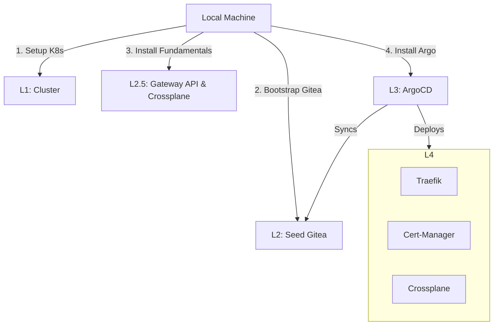
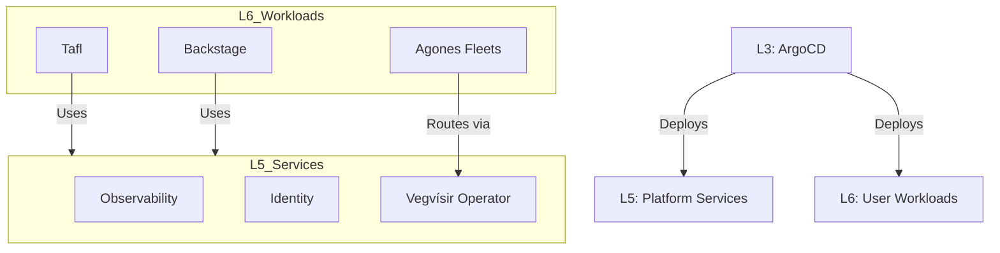

# Nordri Bootstrapping Strategy: The 6-Layer Model

This document details the bootstrapping process for Nordri clusters (GKE and Homelab). It solves the "Chicken and Egg" problem of GitOps (ArgoCD needing a repo to install itself) by introducing a **Layer 2: Seed Gitea**.

Nordri consists of the first 4 layers.

## The Core Concept: "Seed Gitea"

Instead of relying on a central GitHub repository that manages all clusters (which creates single-point-of-failure and complexity for disconnected homelabs), we inject a **Local Gitea Instance** into every new cluster as the *very first step*.

This Gitea acts as the independent "Brain" for that cluster.

### The Hierarchy

1.  **Layer 1: The Substrate (Kubernetes)**
    *   **Action**: Provision the raw Kubernetes API.
    *   **GKE**: `gcloud container clusters create...`
    *   **Homelab**: `k3s server`
2.  **Layer 2: The Seed (Gitea)**
    *   **Action**: Run `./bootstrap.sh --target [gke|homelab]`
    *   **Step A**: Install **Gitea** (Helm) into the `gitea` namespace.
    *   **Step B**: Configure Gitea (Create Admin, Token).
    *   **Step C**: **Hydrate** the repository.
        *   The script takes the local `nordri` checkout.
        *   It selects the correct overlay (`envs/gke` or `envs/homelab`).
        *   It pushes the *Resolved Configuration* to the internal Gitea (`http://gitea-http/nordri.git`).
3.  **Layer 2.5: The Cluster Fundamentals**
    *   **Action**: Install **Gateway API CRDs** and **Crossplane Core Controller**.
    *   **Why**: Required before ArgoCD starts. Traefik depends on GatewayClass, and Provider configs depend on Crossplane CRDs being fully established.
    *   **Why**: Required before ArgoCD starts. Traefik depends on GatewayClass, and Provider configs depend on Crossplane CRDs.
4.  **Layer 3: The Engine (ArgoCD)**
    *   **Action**: Install **ArgoCD**.
    *   **Step A**: Argo is installed via Helm.
    *   **Step B**: Argo is configured with the internal Gitea as a "Repository".
    *   **Step C**: The "Root Application" is applied, pointing to `HEAD` of the internal Gitea.
5.  **Layer 4: The Fundamentals (Cluster Fundamentals)**
    *   **Action**: ArgoCD takes over and installs the "Base System".
    *   **Traefik v3**: The Gateway (Ingress & Gateway API Provider).
    *   **Cert-Manager**: SSL Certificates (Depends on Traefik).
    *   **Crossplane**: Provider Configurations (Kubernetes, Helm).
    *   **Longhorn/NFS**: Storage Classes (Homelab only).
5.  **Layer 5: Platform Services (Nidavellir Base)**
    *   **Action**: ArgoCD Deploys shared services.
    *   **Heimdall**: Observability (Prometheus/Grafana).
    *   **Mimir**: Data (DB flavors, Kafka, Valkey - depends on Crossplane).
    *   **Vegvísir Operator**: Custom controller for dynamic routes.
    *   Keycloak for identity, Nexus for registries, Jenkins for CI/CD, and so on.
6.  **Layer 6: User Workloads (The Apps)**
    *   **Action**: The actual business value.
    *   **Tafl**: Game Orchestrator.
    *   **Demicracy**: Backstage.
    *   **Agones**: Game Servers (Spawned dynamically).

## Diagram 1: The Bootstrap (L1 - L4)



## Diagram 2: The Platform (L5 - L6)



## Repository Structure

To support this "Hydration", the source code is structured to separate shared platform logic from environment specifics.

```text
/nordri
  /platform        # Shared Helm Charts / Kustomize Bases
    /argocd        # The App-of-Apps definition
    /traefik       # Base Traefik config
    /crossplane    # Base Crossplane config

  /envs            # Environment Overrides
    /gke
      /values.yaml # "Enable Cloud Armor", "Use GCS"
    /homelab
      /values.yaml # "Enable NodePort", "Use Garage"
```

## Why this Approach?

1.  **Environment Isolation**: The GKE cluster has absolutely no knowledge of the Homelab cluster, and vice-versa. There is no shared "Master Config" that can accidentally break both.
2.  **Offline Capability**: The Homelab requires no connection to GitHub.com to operate or recover, once the bootstrap script pushes the local files.
3.  **Inspectable State**: The "Seed Gitea" contains the exact state of the cluster. You can verify exactly what manifests Argo is applying by looking at the internal Gitea UI.
4.  **Standardization**: Both environments enable the "Platform" the same way, differing only in the hydration values.
